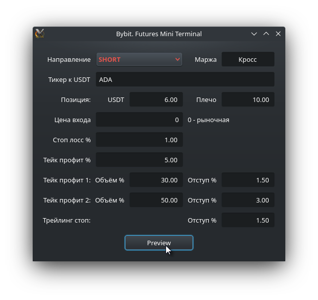
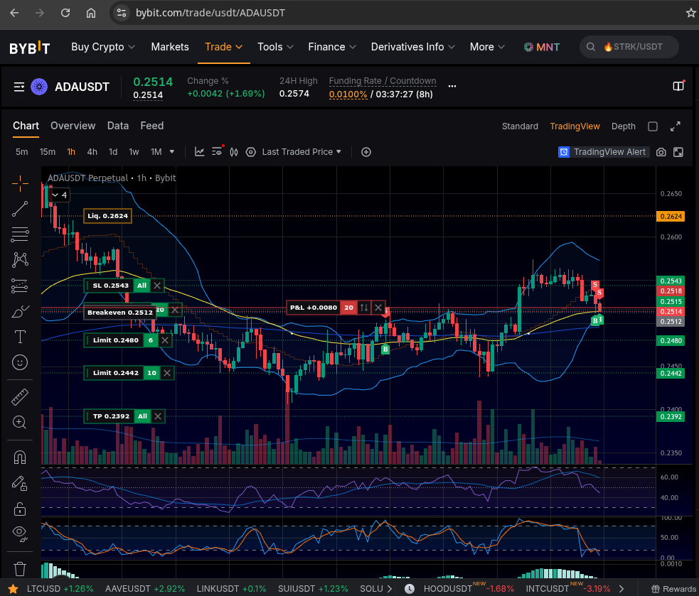

# Bybit Futures Mini Terminal

A lightweight desktop GUI for opening futures positions on Bybit — built with Python and PyQt.


---

## Features

- Open long/short futures positions (linear perpetual) on Bybit
- Market or limit entry orders
- Automatic Stop Loss, Take Profit 1, Take Profit 2, and Trailing Stop placement
- Pre-trade confirmation screen with calculated prices
- Balance and ticker validation before order submission
- Trade log in CSV format
- Hedge mode support (positionIdx 1/2)
- Works with Bybit Unified Trading Account (UTA)

## Screenshots

| Input form | Result on exchange |
|:---:|:---:|
|  |  |

## Requirements

- Python 3.8+
- PyQt5 or PyQt6
- Bybit account with API access (Unified Trading Account)

## Installation

```bash
git clone https://github.com/your-username/crypto_mini_terminal.git
cd crypto_mini_terminal

pip install -r requirements.txt
```

## Configuration

Copy `.env.example` to `.env` and fill in your Bybit API credentials:

```bash
cp .env.example .env
```

```env
BYBIT_API_KEY="your_api_key_here"
BYBIT_API_SECRET="your_api_secret_here"
```

> API keys must have **Futures trading** permission enabled on Bybit.

Default trading parameters are stored in `config.json` and can be edited directly.

## Usage

```bash
python main.py
```

1. Fill in the trading form (direction, ticker, position size, leverage, SL/TP levels)
2. Click **Preview** — the app validates inputs, fetches current price and balance
3. Review the confirmation screen with all calculated prices
4. Click **Yes** to place the orders on the exchange

Press `Esc` at any time to exit.

## Running on Windows

The app is fully cross-platform. No code changes required.

1. Install [Python 3.8+](https://www.python.org/downloads/windows/) — check **"Add Python to PATH"** during installation
2. Open Command Prompt or PowerShell in the project folder:
   ```bat
   git clone https://github.com/sergeymusenko/crypto_mini_terminal.git
   cd crypto_mini_terminal
   pip install -r requirements.txt
   ```
3. Copy `.env.example` to `.env` and fill in your API keys:
   ```bat
   copy .env.example .env
   ```
4. Run:
   ```bat
   python main.py
   ```

## Order logic

| Order | Type | Condition |
|-------|------|-----------|
| Entry | Market or Limit | Based on entry price field (0 = market) |
| Stop Loss | Stop order | Always placed |
| TP Final | Take Profit | Always placed |
| TP1 | Limit reduce-only | Market entry only |
| TP2 | Limit reduce-only | Market entry only |
| Trailing Stop | Trailing | Market entry only, activates at TP1 price |

## Project structure

```
crypto_mini_terminal/
├── main.py               # Entry point
├── config.json           # Default parameters
├── requirements.txt
├── .env.example
└── src/
    ├── api/
    │   └── bybit.py      # Bybit API client
    ├── ui/
    │   ├── main_window.py
    │   └── confirmation_screen.py
    ├── logic/
    │   ├── validator.py  # Input validation
    │   └── calculator.py # SL/TP price calculation
    └── logger.py         # CSV trade log
```

## Notes

- **Hedge mode**: the app uses `positionIdx=1` for LONG and `positionIdx=2` for SHORT — make sure your Bybit account is in hedge mode or update `config.json` accordingly
- **Margin mode**: UTA 2.0 does not support per-symbol margin switching via API; the app displays your current account margin mode (read-only)
- **Testnet**: to use Bybit testnet, set `testnet=True` in `src/api/bybit.py`

## License

MIT
